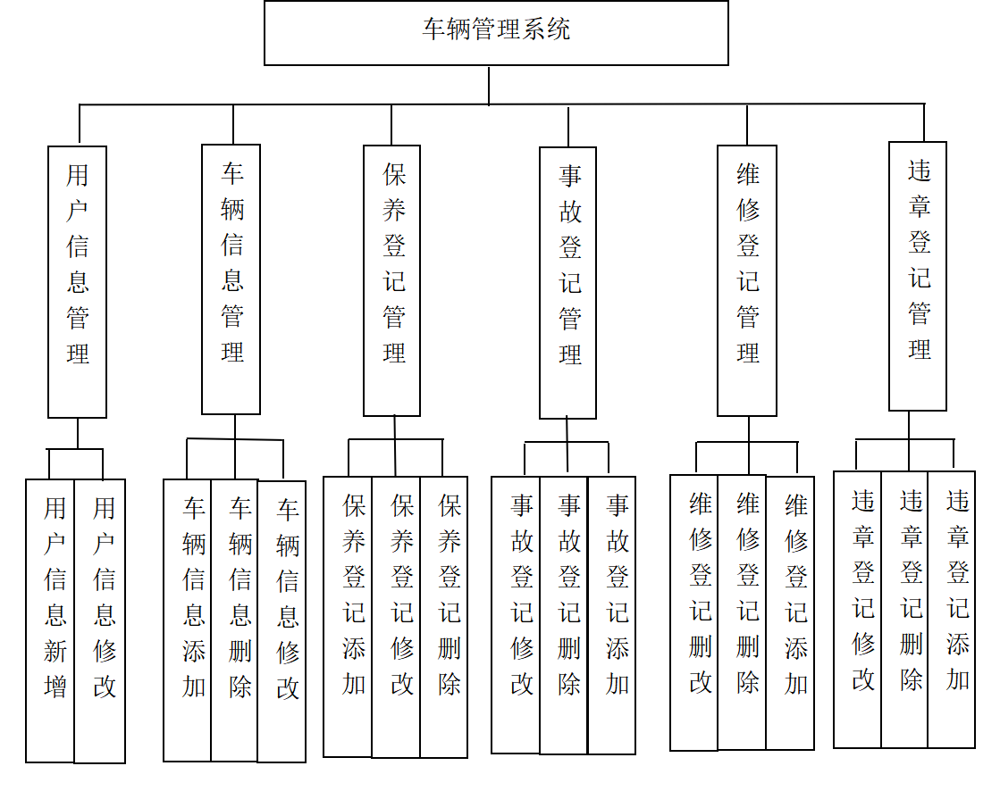
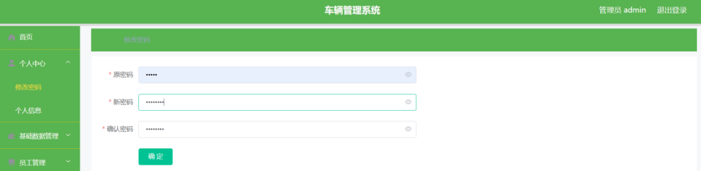
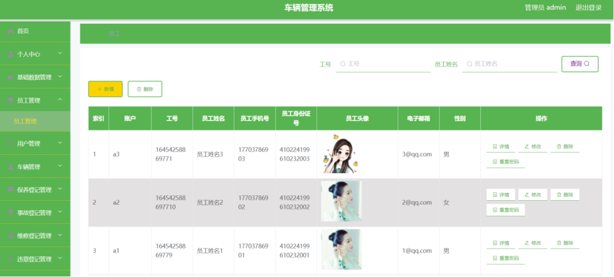
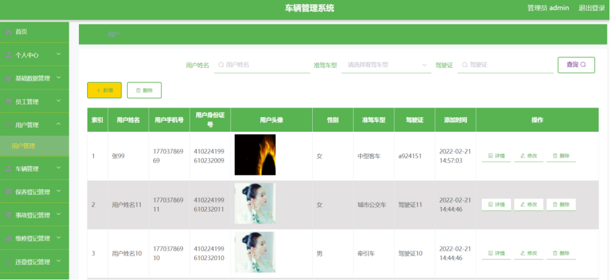
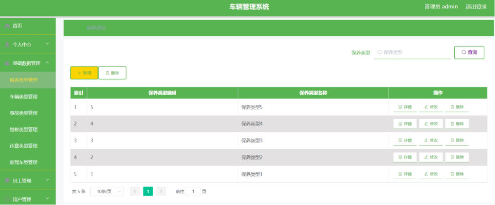
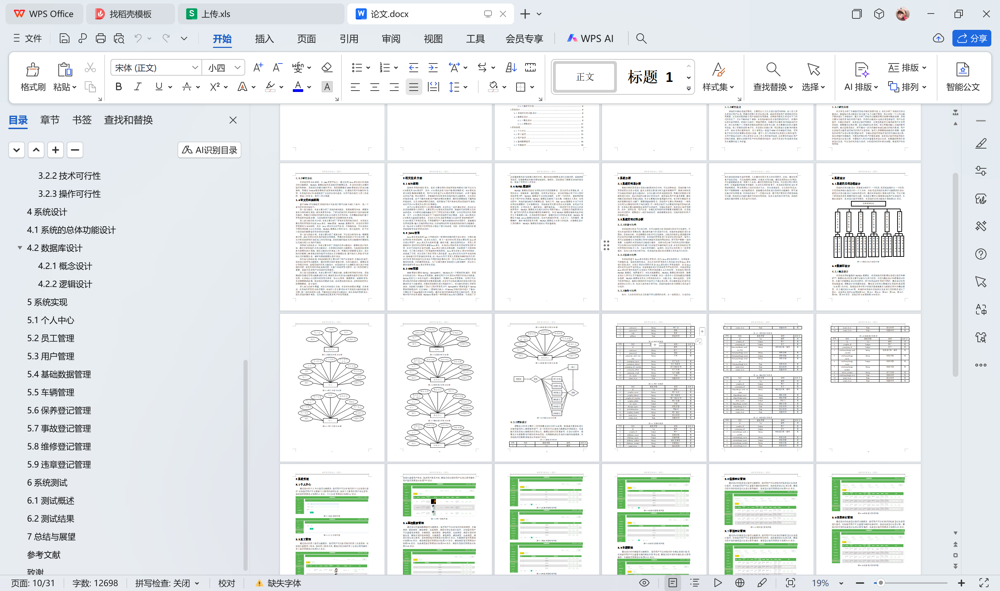

# springboot170-基于SpringBoot的车辆管理系统

>  博主介绍：
>  Hey，我是程序员Chaers，一个专注于计算机领域的程序员
>  十年大厂程序员全栈开发‍ 日常分享项目经验 解决技术难题与技术推荐 承接各类网站设计，小程序开发，毕设等。
>  【计算机专业课程设计，毕业设计项目，Java，微信小程序，安卓APP都可以做，不仅仅是计算机专业，其它专业都可以】

## 3000套系统可挑选，获取链接：https://chaerspol.github.io/

<b>QQ【获取完整源码】：674456564</b>

<b>QQ群【获取完整源码】：1058861570</b>

### 系统架构

> 前端：html | js | css | jquery | vue
>
> 后端：springboot | mybatis
> 
> 环境：jdk1.8+ | mysql | maven

# 一、内容包括
包括有  项目源码+项目论文+数据库源码+答辩ppt+远程调试成功

# 二、运行环境

> jdk版本：1.8 及以上； ide工具：IDEA； 数据库: mysql5.7及以上；编程语言: Java

# 三、需求分析

**3.1系统的需求分析**

需求分析阶段是设计系统功能模块的总方向，可以这样来说，系统的整个的开发流程以及设计进度，基本上都是以需求分析为基本依据的[10]。需求分析阶段可以确定系统的基本功能设计，以及在最后的系统验收阶段，再通过对需求分析报告进行对比，验证系统的功能设计是否合理，能否满足用户的基本需要，最终判断总结系统是否成功现实。本文主要通过问卷调查的方式，来分析车辆管理系统所需要的相关功能[11]。根据调查结果显示，系统用户主要有两种类型，一种是以使用为主要目的的用户角色类型，另一种是以管理为主要目的的管理员角色类型。本系统主要功能需求包括用户信息管理、车辆信息管理、保养登记管理等模块。其中，密码信息、用户信息、车辆信息等都是非常重要的数据记录，在系统设计的过程中，需要进行一定的加密处理，确保数据安全性，切实的保护好用户的重要信息。

**3.2系统的可行性分析**

**3.2.1经济可行性**

对系统进行经济可行性分析，也可以被称为对系统进行经济可行性研究，它是从社会的经济发展出发，通过研究整个的系统可行性，对成本收益情况进行全面地、具体地分析，并且根据所分析的可行性报告，为相关的投资者提供最科学的决策理论和最优的投资方案。本系统的开发促进了企业的信息化管理，管理人员可以直接通过在浏览器上发布车辆管理系统的网站地址，即可用户根据一定的需要，有选择的对系统相关功能进行操作。这种方式打破了时间和空间的限制，可以使得企业在较短的时间内最大化地管理车辆的相关信息。并且本系统所使用的开发技术和相关工具，大部分是开源的、免费的，所以可以节约很大一笔开发成本。综合上述内容分析可知，本系统的实现在经济层面上是具备可行性的。

**3.2.2技术可行性**

本系统是基于Java语言而进行开发的，因为Java语言容易学习、使用简单、可移植性高、稳定性强等特点，所以许多的开发技术人员均喜欢使用Java语言进行系统设计，市场上很多应用程序是由Java语言进行开发实现的。并且Java语言还具有跨平台的优点，这意味着所设计的系统是与平台无关的，也就说明由Java语言开发的系统可以支持在不同的浏览器上运行和使用。本系统使用的是MySQL数据库，相同条件下，对比其他数据库，MySQL数据库语法简单，数据库设计人员可以尽可能快的对其学习和掌握，所以一直是中小型系统最优的数据库选择。MySQL数据库还具有占用系统内存少、功能齐全、响应速度快、使用不收费等特点，能够在极短时间内处理上千条信息记录，所以能够保证系统可以高效地运行和工作。综合上述内容分析可知，系统的实现在技术层面上是具备可行性的。

**3.2.3操作可行性**

如今，人们的日常生活已经离不开互联网的使用，在一定程度上，行业的信息化建设促进着社会的发展。人们通过使用手机上的应用程序，比如，通过使用电子商务系统，可以实现网上购物、在线支付等功能；通过使用国家官方网站，可以查看最新消息，申报个人业务；通过使用医院管理系统，可以进行网上预约挂号，在线查看体检报告等操作。在这些应用的背景下，本系统使用的是B/S开发结构模式，网站界面以人性化的设计为主，具有美观友好、交互性好等优点，用户不需要掌握一定的编程技术，直接通过对系统进行简单的功能操作，即可满足自己的使用需求。本系统还设计了一些提示信息，便于用户更好的理解系统相关功能，较快的以正确的操作方式来使用系统。综合上述内容分析可知，系统的实现在操作层面上是具备可行性的。

# 四、功能模块

系统的总体功能设计，是需求分析的下一个阶段，是系统实现的上一个阶段，它是系统详细功能设计的一个大方向，也就是说系统的各类子功能模块的设计，都是以总体功能设计为目标而进行的。通过对系统进行需求分析可知，可以大致了解系统具体所需要的相关功能。本系统主要的功能需求包括用户信息管理、车辆信息管理、保养登记管理等模块。本系统的总体功能设计图如图。

# 五、效果图展示【部分效果图】

图5-1修改密码界面【通过设计的个人中心管理功能模块，管理用户可以对相关的个人信息进行管理，比如管理用户可以更新个人账号的密码信息，修改个人账号的用户名信息等，修改密码界面设计如图】

图5-2个人信息界面【个人信息界面设计如图5-2所示。】

图5-3员工管理界面【通过设计的员工管理功能模块，管理用户可以管理相关的员工信息资料，比如进行查看员工姓名，修改员工联系方式，删除已经注销的员工信息记录等操作，员工管理界面设计如图5-3所示。】

图5-4用户管理界面【通过设计的员工管理功能模块，管理用户可以管理相关的用户信息资料，比如进行查看用户姓名，修改用户联系方式，删除已经注销的用户信息记录等操作，用户管理界面设计如图5-4所示。】

图5-5保养类型管理界面【通过设计的基础数据管理功能模块，管理用户可以对相关的保养类型、车辆类型、事故类型、维修类型、违章类型、准假车型信息进行管理，比如管理用户可以查看保养类型、车辆类型、事故类型、维修类型、违章类型、准假车型的详情信息，删除失效的保养类型、车辆类型、事故类型、维修类型、违章类型、准假车型信息记录等，保养类型管理界面设计如图】

 <b>完整文章</b>
 

 

## 3000套系统可挑选，获取链接：https://chaerspol.github.io/

<b>QQ【获取完整源码】：674456564</b>

<b>QQ群【获取完整源码】：1058861570</b>

